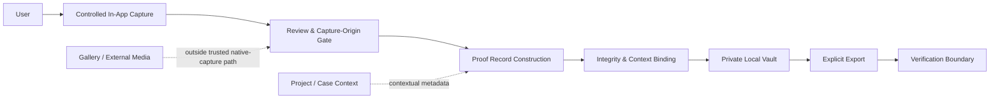
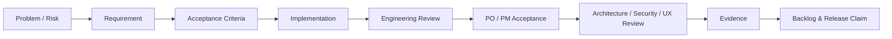

# Proof Camera — Product Architecture & Delivery Case Study

> **Independent Android product in active development**  
> **Public case study — implementation source remains private**

Proof Camera explores a practical trust problem in mobile photography:

**How can a mobile product create a clearer, more reviewable chain between an in-app capture and the proof record that is later stored, reviewed, and shared?**

The project is intentionally broader than a camera interface. It combines **product strategy, Product Ownership, business and systems analysis, Android architecture, privacy and security requirements, UX flows, acceptance criteria, technical review, and evidence-based delivery governance**.

This repository presents the **durable product thinking and architecture** behind the work. The application itself continues to evolve in a private source repository, so this case study is designed to remain useful across implementation iterations rather than mirror individual commits.

---

## What this case study demonstrates

- Framing an ambiguous trust/provenance problem as a product problem with explicit boundaries.
- Turning product and security risks into testable requirements and acceptance criteria.
- Designing a **local-first Android workflow** around controlled capture, review, proof-record construction, private storage, integrity checks, export, and verification.
- Balancing usability with stronger provenance controls instead of relying on security claims alone.
- Decomposing product intent into implementation-ready backlog items and review gates.
- Governing AI-assisted engineering through human-owned requirements, architecture, acceptance, and evidence.

## My role

**Independent Product Owner / Business Systems Analyst / Product & Solution Designer**

I own the work across:

**problem framing → product scope → requirements → architecture → backlog decomposition → acceptance criteria → implementation review → risk review → delivery evidence**

The project also involves hands-on technical work and close inspection of the Android implementation, while the public repository deliberately focuses on the product, systems-analysis, and architecture layer rather than exposing proprietary source code.

---

## Product at a glance

| | |
| --- | --- |
| **Platform** | Native Android |
| **Product type** | Local-first proof-capture and integrity workflow |
| **Primary design concern** | Preserve a clear distinction between controlled in-app capture and media from outside that capture path |
| **Core workflow** | Capture → review → proof record → private vault → export / verification |
| **Technology context** | Kotlin, Jetpack Compose, CameraX, Android platform security capabilities |
| **Requirements style** | User stories, business rules, Gherkin acceptance criteria, non-functional/security requirements |
| **Delivery model** | Backlog-driven, adversarial review, acceptance gates, evidence-based status control |
| **Implementation source** | Private |

---

## The product problem

Conventional mobile photo workflows optimize for convenience: camera images, downloads, edits, screenshots, and imported media can all coexist in the same ecosystem. That is appropriate for ordinary photography, but it creates ambiguity when a user later needs to show **how a particular record entered a controlled workflow and what happened to it afterward**.

Proof Camera addresses that problem by treating a proof record as more than an image. The product design introduces a controlled acquisition path, a structured local record, integrity information, contextual metadata, private storage, and explicit export/verification boundaries.

The product does **not** assume that a phone can prove every real-world fact about a scene. Its goal is narrower and more defensible: create a better-defined capture and record process, make provenance-relevant states visible, and avoid claiming more than the system can support.

---

## Architecture overview



The public architecture shows **responsibilities, trust boundaries, and data flow**. It intentionally omits implementation-specific class structures, algorithms, thresholds, storage layouts, key-management details, and build configuration.

[Read the architecture case study →](docs/architecture.md)

---

## Five product rules that shape the design

1. **Capture origin matters.** Media entering from outside the controlled native capture path must not silently acquire the same provenance status as an in-app capture.
2. **A proof record is more than an image.** Media, integrity information, record state, and permitted context are treated as one product object.
3. **Local-first is a product choice.** Core capture and record workflows are designed not to depend on a remote account or cloud service as their basic source of truth.
4. **Sharing is deliberate.** Export is a user action with explicit product boundaries, not a side effect of ordinary navigation.
5. **Claims are bounded by evidence.** Requirements, implementation, build results, runtime behavior, acceptance, and external claims are treated as different layers of evidence.

[Read the security & integrity principles →](docs/security-principles.md)

---

## Representative business-analysis deliverable

A public portfolio does not need hundreds of backlog tickets. One well-formed specification can demonstrate how a product risk becomes an engineering requirement.

```gherkin
Feature: Trusted native capture origin

  Scenario: External media is not promoted to trusted native proof
    Given media did not originate from the controlled in-app capture path
    When the application evaluates it for trusted proof creation
    Then it must not receive the same trusted capture status as an accepted native capture
      And the distinction must remain visible in the resulting product state
```

The private project extends this pattern into detailed edge cases, failure modes, platform behavior, destructive actions, export rules, and evidence expectations.

[See the full public sample specification →](docs/sample-spec.md)

---

## Product decisions, not just features

This project is useful as a case study because the difficult work is not “add a camera button.” The important decisions include:

- defining what **trusted capture** means without overstating what a mobile device can prove;
- choosing **local-first** behavior and app-private storage as a product boundary;
- deciding which metadata is contextual and which information participates in integrity semantics;
- separating product organization concepts such as project/case context from the proof claim itself;
- designing export and verification as explicit lifecycle steps;
- treating security copy, acceptance criteria, and actual system behavior as one product responsibility.

[See product scope & decision framework →](docs/product-scope.md)

---

## Delivery method

The private project is managed as a product-engineering system rather than an open-ended coding exercise:



A central discipline is that **“code exists” is not treated as equivalent to “the requirement is accepted” or “the product is release-ready.”** This makes status reporting more reliable and keeps external claims tied to evidence.

AI tools are used within this workflow for decomposition, implementation assistance, static review, adversarial critique, and consistency checking. Product intent, architecture, prioritization, acceptance, and final claims remain human-owned.

[Read the engineering & AI-assisted R&D method →](docs/engineering-method.md)

---

## Public vs. private boundary

### Public here

Product problem · target users · architecture · trust boundaries · selected requirements · representative Gherkin · security principles · delivery method · sanitized UI / diagrams

### Private by design

Application source · Gradle/build configuration · exact algorithms and thresholds · security implementation details · class/package structure · full backlog · complete test matrices · defect/remediation history · internal runtime evidence · credentials/signing material · raw AI working logs

[Read the publication boundary →](docs/showcase-boundary.md)

---

## Repository map

```text
proof-camera-product-case-study/
├── README.md
├── RECRUITER_SUMMARY.md
├── docs/
│   ├── architecture.md
│   ├── product-scope.md
│   ├── sample-spec.md
│   ├── security-principles.md
│   ├── engineering-method.md
│   └── showcase-boundary.md
└── assets/
    └── mockups/
```

---

## Why the source is private

The purpose of this portfolio is to show **how I frame, specify, architect, challenge, and govern a software product**. Publishing executable source is not necessary to evaluate those capabilities and would expose implementation detail that belongs to the private product repository.

The case study therefore follows a simple rule:

> **Show the reasoning, architecture, requirements quality, and delivery discipline — keep proprietary implementation private.**

---

### Scope note

Proof Camera is an active independent product project. This repository is a portfolio case study, not a release note, certification statement, forensic accreditation, legal notarization claim, or exhaustive description of the current private build.
