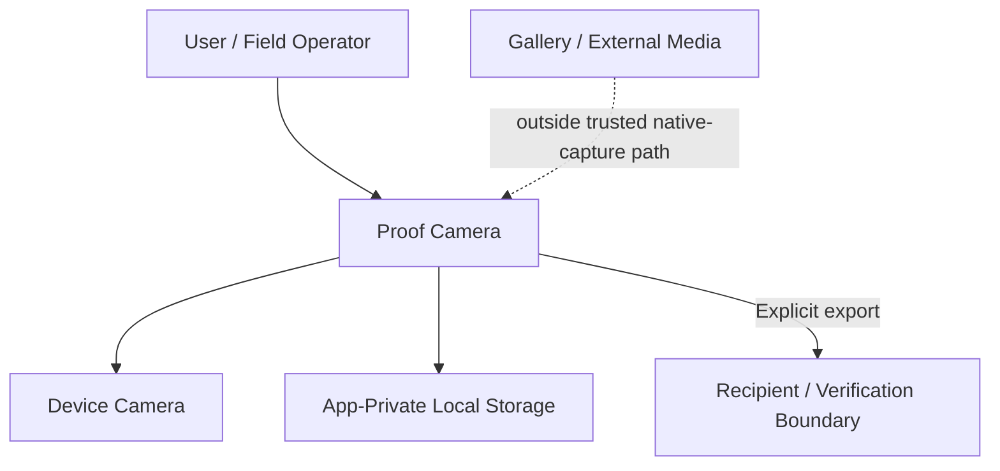
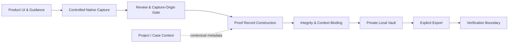
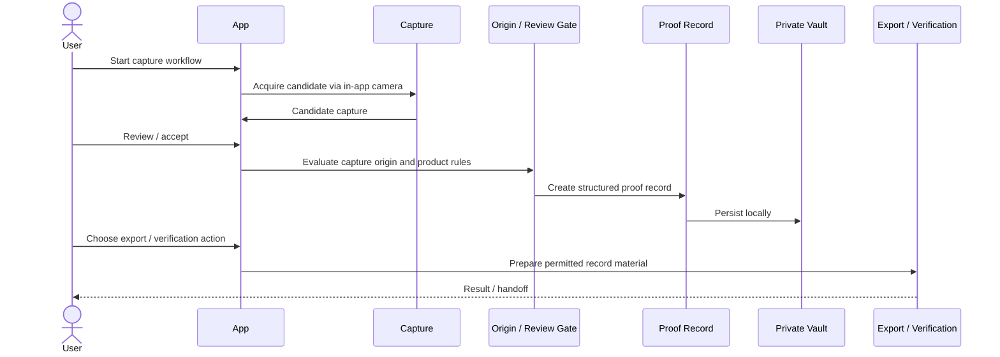

# System Architecture

## Architectural objective

The system is designed around one central product requirement:

> **Preserve a clear, reviewable distinction between media acquired through the product's controlled capture path and media whose origin is outside that path.**

This is deliberately narrower than claiming that a mobile device can prove every fact about a scene. The architecture instead controls the parts of the lifecycle the application can reasonably own: acquisition path, record construction, local integrity semantics, storage boundary, export, and verification behavior.

## Context view

## Responsibility view

| Responsibility | Product purpose |
| --- | --- |
| Product UI & guidance | Explain the workflow, trust boundaries, actions, and consequences in user terms. |
| Controlled native capture | Acquire candidate media through the application's intended capture path. |
| Review & capture-origin gate | Keep external/untrusted origin distinguishable from controlled native capture. |
| Proof record construction | Turn an accepted capture into structured local record state rather than treating the image file as the whole product object. |
| Integrity & context binding | Associate integrity information and permitted contextual metadata with the proof record. |
| Project / case context | Organize work without confusing organizational metadata with proof of the underlying real-world event. |
| Private local vault | Keep the core record lifecycle local and under the application's private storage boundary. |
| Explicit export | Make disclosure/sharing a deliberate lifecycle step. |
| Verification boundary | Provide a place to evaluate exported record integrity and product claims without assuming external truth beyond the evidence carried by the record. |

## High-level data flow

## Key architectural decisions

### 1. Local-first core
The product is designed so the basic proof lifecycle does not depend on a remote account or cloud service as its source of truth. This supports privacy, resilience, and clearer system boundaries.

### 2. Capture origin is a first-class state
Origin is not treated as incidental metadata. The product must preserve the distinction between controlled in-app capture and external media through the lifecycle.

### 3. Proof record ≠ image file
A proof record is a structured object combining the media with integrity information, lifecycle state, and permitted context.

### 4. Context is not evidence of truth
Project, case, or team labels can organize records, but they do not independently prove the event or scene represented by the media.

### 5. Export is a boundary
Moving proof material outside the application's private storage is treated as an explicit product action with its own rules rather than as a transparent implementation detail.

## Deliberately excluded implementation detail

This public architecture does not publish class/package structure, exact integrity algorithms, thresholds, key-management logic, local file layout, build configuration, dependency versions, full threat models, or internal test evidence.
