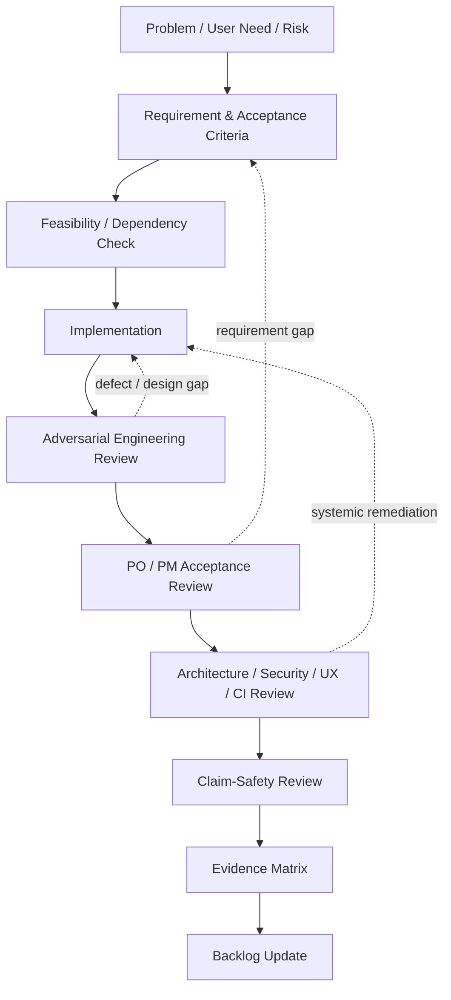

# Engineering & AI-Assisted R&D Method

## Objective

The project is managed as a product-engineering system rather than as an open-ended coding exercise. Product intent, implementation, verification, and external claims are deliberately separated.

## Delivery loop

## Evidence discipline

Different questions require different evidence:

| Layer | Question |
| --- | --- |
| Requirement | Is the intended behavior explicit, justified, and testable? |
| Feasibility | Can it be delivered within platform, dependency, and product constraints? |
| Implementation | Is the intended behavior represented in the product/source? |
| Build | Can the relevant product configuration compile/package successfully? |
| Runtime | Does the behavior operate correctly in the intended environment? |
| Acceptance | Does the observed result satisfy the original criteria? |
| External claim | Is the wording used externally no stronger than the available evidence? |

This prevents status inflation and makes delivery discussions more useful to both technical and non-technical stakeholders.

## AI-assisted development approach

AI is used as an **engineering accelerator and adversarial review partner**, not as the owner of product truth.

Representative uses include:

- decomposing product epics into implementation-ready work;
- challenging user stories and acceptance criteria for ambiguity;
- generating implementation candidates for private review;
- cross-file consistency and static-analysis support;
- adversarial senior-engineering critique;
- PO/PM acceptance review against the requirement rather than the implementation narrative;
- security, privacy, UX, CI, and release-truth review;
- maintaining remediation tables and evidence matrices.

Human ownership remains with product scope, prioritization, architecture decisions, acceptance criteria, risk decisions, and final external claims.

## Why this matters for product roles

The project demonstrates work at the boundary between **business need and technical execution**. Requirements are made specific enough for engineering, implementation is challenged against product intent, and progress reporting is constrained by evidence rather than optimism.
